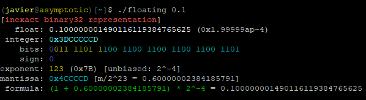

# Floating
--------

`floating` is a simple command-line tool for exploring IEEE754 floating-point formats.

It can show you the bit strings of single-precision (**binary32**) and double-precision (**binary64**)
floats.  It can also show you a number's floating-point neighbors, i.e., the *next* or *previous* values.

You can give `floating` a bit string as an integer and it will tell you the floating-point value.

## Compiling
It should compile cleanly on any Linux system with a relatively recent gcc.

Run `make` or, optionally, `make install`.  Default installtion location is /usr/local/bin, but
this can be changed in the Makefile.

## Usage

Calling `floating` with the `-h` flag shows the help:

```
./floating -- show binary representation of an IEEE754 floating-point number
Usage:

  ./floating [options] <number>

where <number> can be in decimal (3.14), hex (0x42), exponential (1.4E-12), or
binary exponent (0x1.4p+1) form.

Options:
  -d      use double-precision binary64 format
  -f      show a few interesting IEEE754 facts
  -i      treat the input as an integer bit string, then interpret as float
  -P      increment the given number to the next floating-point value (Plus)
  -M      decrement the given number to the previous floating-point value (Minus)

NB: to enter a negative value, use '--' to stop processing arguments, e.g.,
  ./floating -d -- -3.14
```

## Examples

The single-precision representation of 1.25 is exact:


In contrast, 0.1 is non-terminating in base-2 and so must be approximated:



We can use binary exponent form to describe the approximation exactly:


Positive infinity is represented by all exponent bits set and all mantissa bits off,
which we can express with the integer 0x7800000:


Adding one to this value (`-P`) gives us the first NaN in the sequence:


## Author

Javier Lombillo <javier@asymptotic.org>
May 2021
